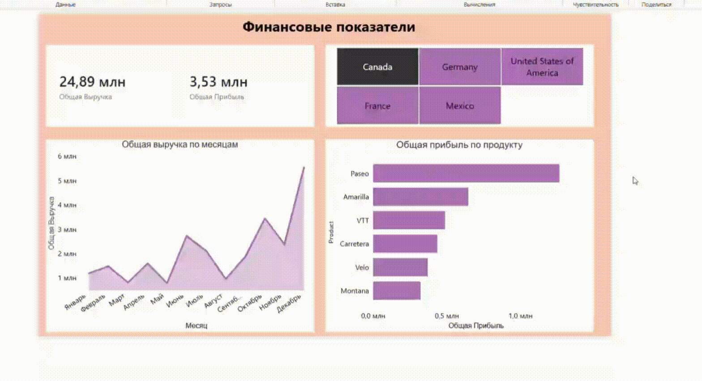

# Дашборд финансовой аналитики продаж (Sales Performance Dashboard)

## Бизнес-задача
Руководству компании требовался инструмент для отслеживания ключевых финансовых показателей (выручка и прибыль) в реальном времени. Основная цель - понять динамику продаж в течение года, определить наиболее маржинальные продукты и проанализировать результаты по разным странам для оптимизации стратегии сбыта.

## Инструменты и методы
В ходе выполнения проекта были использованы следующие инструменты и технологии:
* **Power BI Desktop:** Основная среда разработки дашборда.
* **Power Query:** Очистка данных, проверка типов данных, удаление избыточных столбцов для оптимизации модели.
* **DAX (Data Analysis Expressions):** Написание явных мер для бизнес-метрик. 
  *Реализованные меры:*
  ```dax
  Общая Выручка = SUM(financials[Sales])
  Общая Прибыль = SUM(financials[Profit])



## Вывод:
Наиболее прибыльным товаром в подборке является Paseo, тогда как продукт Carretera приносит наименьшую прибыль. Финансовые показатели сильно варьируются в зависимости от региона продаж. Динамика выручки показывает ярко выраженный пик в 4 квартале, что указывает на высокую сезонность спроса к концу года.
  
